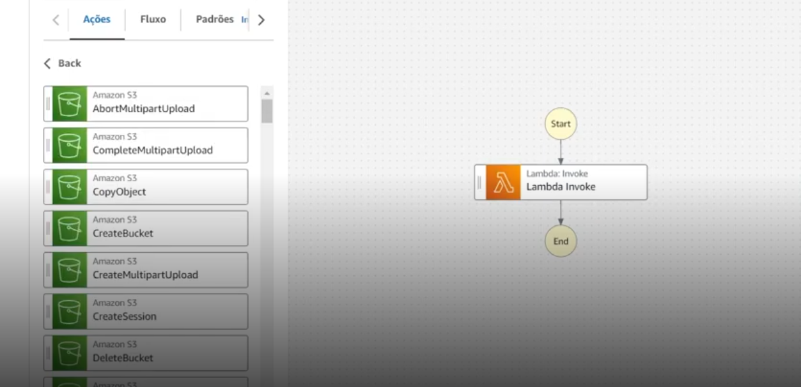
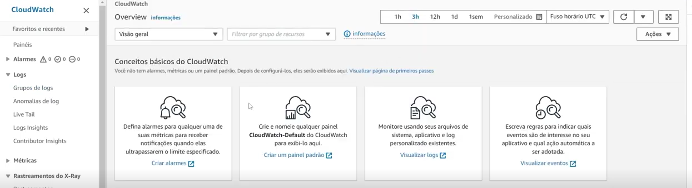
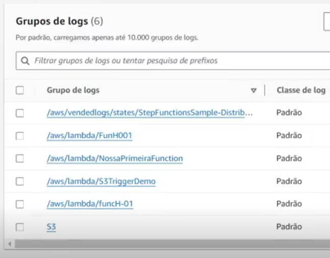
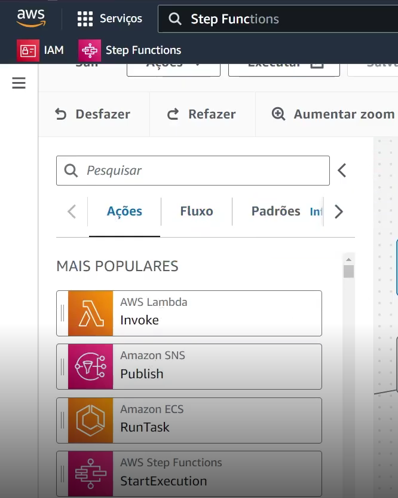

# Desafio: Explorando Workflows Automatizados com AWS Step Functions

*Nesse desafio, aprofundamos os conhecimentos sobre as Step Functions da AWS. Como utilizá-las para automatizar projetos e processos de trabalho, além de conhecer maneiras de proteger e acompanhar esses processos por meio do CloudWatch.*

*Além de analisarmos como utilizar as Lambdas nas AWS Functions, também exploramos a Amazon States Language. Essa linguagem estruturada, baseada em JSON, permite definir uma coleção de estados que executam tarefas e determinam as transições entre eles. Como foi mostrado durante o desafio, conseguimos compreender não apenas a teoria por trás das Step Functions, mas também como aplicá-la na prática para controlar fluxos de execução, identificar erros e garantir maior confiabilidade nos processos.*

