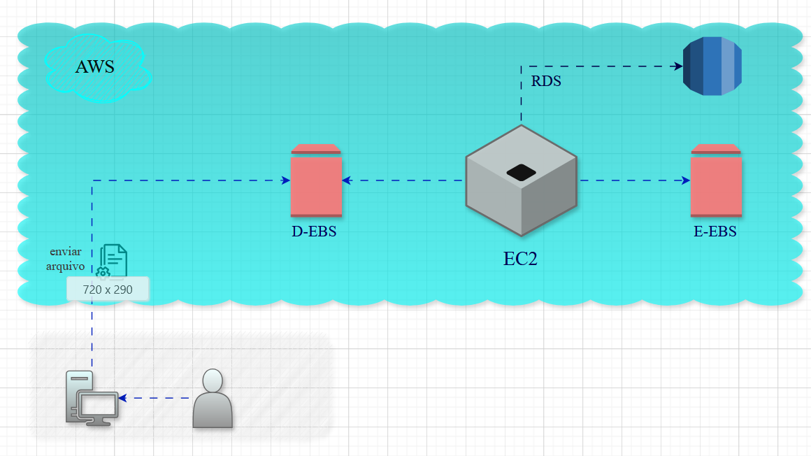

# Desafio: Gerenciando Instâncias EC2 na AWS

:computer: *Esse desafio mostrou de forma visual e organizada as principais funcionalidades da Amazon Elastic Compute Cloud (EC2), destacando cada processo e sua importância dentro do gerenciamento de instâncias.*

Sendo esses:
- Acesso ao Console da AWS
- Navegação até o Serviço EC2
- Lançamento da Instância (Launch Instance)
- Conexão à Instância
- Segurança

*A proposta é facilita a compreensão prática dos recursos, permitindo visualizar como cada etapa contribui para a eficiência e segurança da infraestrutura em nuvem. Como mostrado nas imagens*

---
## EXPLICAÇÃO:

**Fluxo Tradicional (EC2 + EBS + RDS)**

*Este diagrama mostra o fluxo de dados dentro de um ambiente AWS com EC2, EBS e RDS:*
---
- :busts_in_silhouette:Usuário envia arquivo.

- :card_file_box: Arquivo chega ao EC2 -> A instância EC2 funciona como servidor principal, processando os dados recebidos.

- :file_cabinet: Armazenamento em EBS (Elastic Block Store)
  > D-EBS / E-EBS: volumes de armazenamento conectados ao EC2, usados para guardar dados temporários ou persistentes.

- :warning: Importância: garante que os dados processados tenham suporte de armazenamento confiável.

- :handshake: Integração com RDS-> O EC2 se comunica com o banco de dados relacional RDS.

- :incoming_envelope: Fluxo contínuo: Usuário interage com o sistema, enviando e recebendo informações que passam por EC2, EBS e RDS.

---

**Fluxo Automatizado(S3 + Lambda + DynamoDB)**

*Este diagrama mostra um fluxo automatizado de upload, processamento e armazenamento usando S3, Lambda e DynamoDB.*
---
- :busts_in_silhouette: Usuário envia arquivo → O arquivo parte do sistema local (computador).

- :card_file_box: Upload para Amazon S3 -> o arquivo é transferido via AWS CLI ou outro método.

- :warning: Importância: S3 é o repositório inicial, seguro e escalável.

- :bulb:Trigger automático -> O upload no S3 dispara um evento (trigger) -> Esse evento ativa uma função AWS Lambda.

- :card_index_dividers: O Lambda processa o arquivo (pode ser em Node.js, .NET Core ou Python).

- :floppy_disk: Os dados processados pela Lambda são gravados no banco NoSQL DynamoDB.

- :warning: Importância: garante alta performance e flexibilidade para consultas rápidas.

---
[Diagramas: Drawio.com](https://www.drawio.com/)
